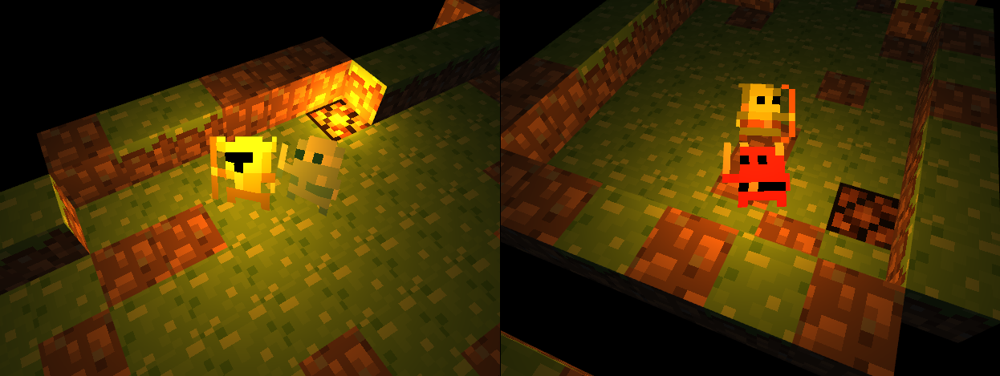
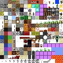
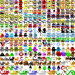
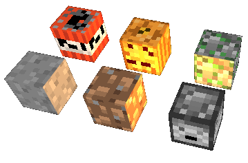
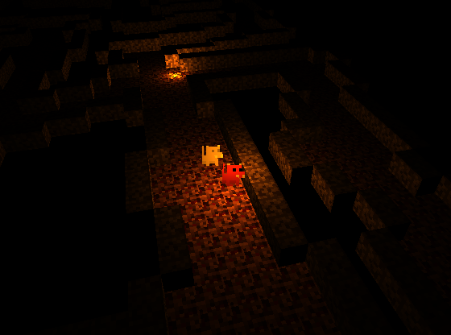

<link href="https://raw.github.com/jasonm23/markdown-css-themes/gh-pages/swiss.css" rel="stylesheet"></link>
<link href="style.css" rel="stylesheet"></link>

Description
===========

This project is a 2.5D dungeon exploration game. In this case, 2.5D refers to 
the fact that characters in the world are 2D objects (sprites) that exist in a 
3D environment. A technique called "billboarding" is used to keep sprites 
perpendicular to the line of sight of the camera, such that they are always 
facing the camera, creating the illusion that the 2D sprites are actually a part 
of the 3D world.

Setup
=====

The code can be found in the attached files, but they must be uploaded to a 
webserver before the game can be played, due to require.js's method of loading 
text files. A lightweight webserver for Windows that can be used is 
[mongoose][1] - using the program's default settings, open the program and 
navigate to `localhost:8080` in a browser to play the game. Any other webserver 
such as Apache HTTP, Apache Tomcat, or nginx can also be used.

A playable version can also be found at:

* [http://ee.walfas.org/webgl](http://ee.walfas.org/webgl)
* [http://ee.walfas.org/webgl/iframe.html](http://ee.walfas.org/webgl)

Gameplay
========

###Objective

_Entrance (left) and exit (right) of one floor of the dungeon_

The goal of the game is to explore a multi-level dungeon, guiding a follower to 
the exit of each floor. Characters and dungeon layouts are randomized on each
playthrough.

###Controls

* WASD keys for movement
* Right-click + drag to rotate the camera
* Scroll wheel to zoom in/out

Implementation
==============
The project is implemented in WebGL, using the following libraries: 

* [glMatrix][2]: convenient matrix and vector functions.
* [require.js][3]: allows code to be separated into different module files, 
  manages inter-module dependencies, and allows modules to be loaded when 
  needed.

###Textures

Textures are stored in [texture atlas][4] image files -- images that contain 
many sub-images, each of which is a texture for some part of a 3D object. Since 
the application uses a lot of small textures for different objects (e.g., the 
terrain and characters), it is more efficient to use a large texture atlas than 
it is to bind several smaller textures when rendering. Sub-textures are chosen 
from the texture atlas by specifying texture coordinates of the object's uvmap 
based on the desired texture.

_Texture atlases used in the game_

In the case of this game, environment textures are loaded from a Minecraft 
[`terrain.png`][5]-styled texture atlas, and characters are from Oryx's [LOFI 
Fantasy spritesheets][6].

###Cube Generation

_Some examples of textured cubes_

The environment in the game is composed of textured cubes, where each face of a 
cube is loaded from the texture atlas. Cubes are specified by a 3D array, where 
the position in the array corresponds to the position of the cube. For example:

	cubes[5][0][3] = 4;
	cubes[5][0][4] = 0;

means that the cube located at `(3,0,5)` has textures corresponding to the 4th 
tile in the texture atlas, and the cube at `(4,0,5)` is an empty cube (`0` 
specifies that nothing is there). 

Each cube has six faces, but not all faces will be shown (e.g., if two cubes are 
right next to each other, the right face of the left cube and the left face of 
the right cube will never be seen).  When establishing the arrays to bind to the 
buffers (positions of vertices, texture coordinates, normals, etc), unnecessary 
faces of the cube are removed to reduce the amount of data that has to be sent 
to and processed by the GPU. 

###Level Generation

_An example of a randomly generated dungeon_

Each floor of the dungeon is randomly generated based on a simple [Roguelike 
dungeon generation algorithm][7]. The entire map is divided into a grid of 
rooms, with each room being a random size. Rooms are then randomly connected to 
neighboring rooms until eventually all rooms are connected. Connections 
(passageways) are made between the centers of each room using a version of 
[Bresenham's line algorithm][8] with thicker lines. The final result is sent to 
the cube generation stage and various cube types are chosen for walls and floors 
based on what level of the dungeon the player is in. 

###Characters

_A billboarded character. Note that the character's orientation remains the same 
regardless of the camera angle._

Characters are randomly chosen from a texture atlas of character sprites. To 
achieve a 2.5D effect, characters are individually billboarded -- they are 
always facing the camera. This is done in a separate vertex shader, so the 
environment is rendered first, the current glsl program is changed, and the 
characters are then rendered. A description of billboarding implementation can 
be found on NeHe's "[Billboarding How To][9]" page.

The billboarding vertex shader also applies a wobble effect to the billboarded 
sprites, inspired by the animations in a similar game, [Bitworld][10]. The 
wobble effect changes depending on whether or not the sprite is currently moving 
(as defined by the program).

A simple collision detection test was implemented so that the sprites are unable 
to walk through walls. The test involves checking the 3D cubes array to check if 
the corresponding sprite position overlaps with a non-empty cube. If the test 
passes, don't allow the sprite to move in that direction.

###Camera

The camera is treated as an object in the world, centered around the player 
sprite. The position of the camera relative to the player is defined in 
spherical coordinates -- rotation angles around the X- and Z- axes, and a 
distance from the center of the sphere. The angles can be adjusted by 
right-clicking and dragging the mouse, and the distance can be adjusted by using 
the scroll wheel. After converting to a Cartesian coordinate system and applying 
a `lookAt` function, the view matrix is obtained.

###Lighting

_Point light sources in an environment with low ambient lighting_

Aside from ambient lighting (which varies based on the level), point light 
sources with attenuation were implemented. A single point light source is 
positioned above the player, while a second point light source (with less 
attenuation) is positioned at the entrance of each level.

Information about point light sources is passed to the fragment shaders as 
uniform structs.

Future Work
===========

###Shadow Mapping

Shadow mapping is a technique that allows objects to cast shadows based on their 
positions relative to light sources. It requires rendering the scene from the 
perspective of each light source (up to six times for point sources), to 
determine depth information. The scene is rendered to an intermediate depth 
texture, and this depth information is used to determine if certain parts of the 
scene are behind objects. This is similar to rendering reflective surfaces, 
except depth information is used, and the texture itself is not rendered.

###Ambient Occlusion

If an object is surrounded by other objects, it would make sense for the object 
to appear darker. Ordinary implementations of ambient lighting do not consider 
this (the same ambient light is applied to the entire scene regardless of its 
position relative to other objects). Ambient occlusion can be calculated by 
determining the number of rays exiting the surface that do not intersect another 
object. Surfaces with more of these rays are rendered brighter.

###Camera Collision

In many games, it does not make sense for the line of sight between the player 
and the camera to be blocked by an object. The camera should also not be able to 
move through solid objects. This can be addressed by extending a ray from the 
player toward the camera, and checking if this ray intersects a solid object. 
The camera should be placed at that intersection point to keep the player in 
sight at all times. The previous distance of the camera from the player should 
be remembered so that when the ray no longer intersects an object, the camera 
can return to its original distance (with some smoothing applied so the 
transition doesn't appear instantaneous and jumpy).

###General Gameplay

The gameplay itself could be improved by adding obstacles, enemies, items, a 
combat system, etc.

<!-- Footnotes -->
[1]: https://code.google.com/p/mongoose/downloads/list
[2]: http://glmatrix.net/
[3]: http://requirejs.org/
[4]: http://en.wikipedia.org/wiki/Texture_atlas
[5]: http://www.minecraftwiki.net/wiki/File:TerrainGuide.png
[6]: http://forums.tigsource.com/index.php?topic=8970.0
[7]: http://kuoi.com/~kamikaze/GameDesign/art07_rogue_dungeon.php
[8]: http://en.wikipedia.org/wiki/Bresenham's_line_algorithm
[9]: http://nehe.gamedev.net/article/billboarding_how_to/18011/
[10]: http://forums.tigsource.com/index.php?topic=9701.0
